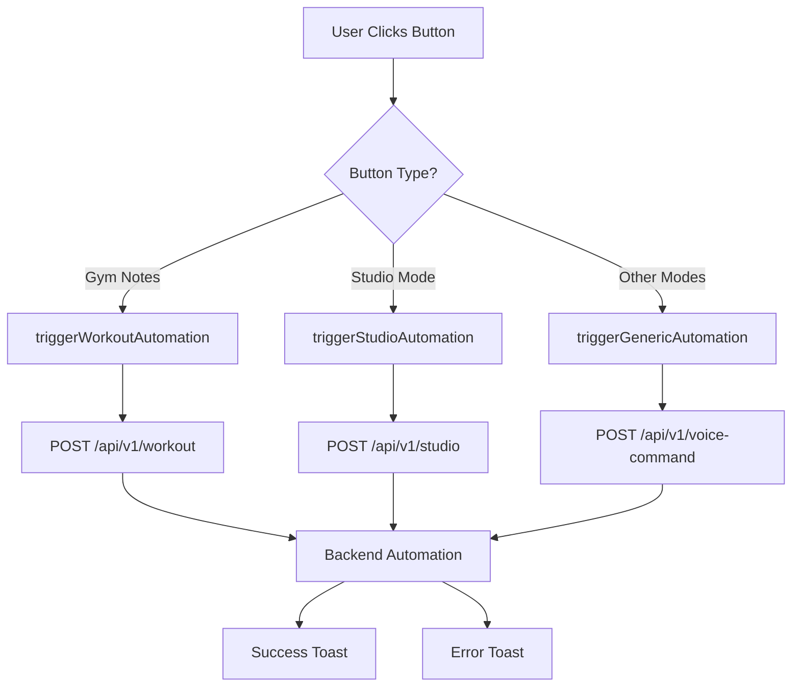
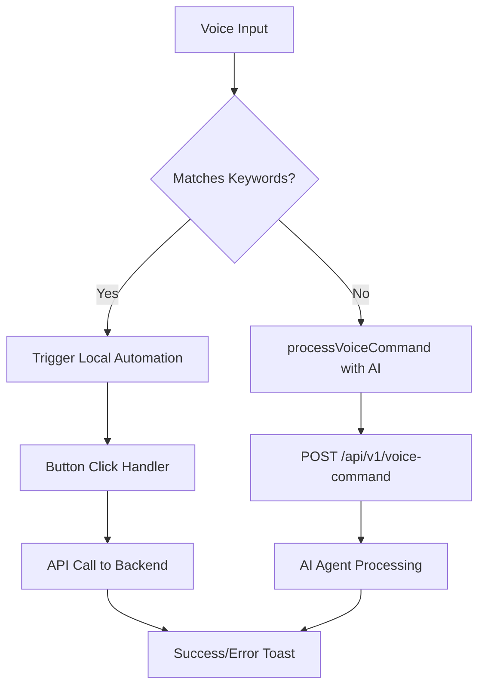

# API Integration Guide

## Overview

This frontend connects to the [Command Orchestra Backend](https://github.com/MiMa6/command-orchestra-backend) to trigger various automations through button clicks and voice commands.

## Backend Connection

### Default Configuration

- **Backend URL**: `http://0.0.0.0:8000/api/v1`
- **Timeout**: 10 seconds
- **Retry attempts**: 3

### Environment Configuration

Create a `.env.local` file in the project root to override the default backend URL:

```bash
# Backend API Base URL
VITE_API_BASE_URL=http://0.0.0.0:8000/api/v1
```

## API Endpoints Integration

### 1. Workout Automations (`/workout`)

**Frontend Buttons → Backend Mapping:**

- **Running** → `POST /api/v1/workout` with `{"workout_type": "running"}`
- **Cycling** → `POST /api/v1/workout` with `{"workout_type": "cycling"}`
- **Mobility** → `POST /api/v1/workout` with `{"workout_type": "mobility"}`
- **Gym** → `POST /api/v1/workout` with `{"workout_type": "gym"}`

### 2. Studio Automation (`/studio`)

**Frontend Button → Backend Mapping:**

- **Studio Mode** → `POST /api/v1/studio` with `{"action": "open_session"}`

### 3. Voice Commands (`/voice-command`)

> **TODO**: Voice command integration is not yet fully implemented in the frontend

**Voice Input → Backend Mapping:**

- Recognized commands trigger local automations
- Unrecognized commands → `POST /api/v1/voice-command` with AI agent processing

### 4. Generic Automations (Voice Command Fallback)

> **TODO**: Voice command fallback for generic automations is not yet implemented

**Unmapped Buttons → Backend Mapping:**

- **Ritual Mode** → Voice command: `"launch ritual mode"`
- **Explorer Mode** → Voice command: `"start explorer mode"`
- **Focus Mode** → Voice command: `"activate focus mode"`
- **Archive Mission** → Voice command: `"archive mission"`

## API Service Functions

### Available Functions

```typescript
// Health check
checkHealth(): Promise<HealthCheckResponse>

// Workout automations
triggerWorkoutAutomation(workoutType: 'running' | 'cycling' | 'mobility' | 'gym', date?: string): Promise<ApiResponse>

// Daily note automations (not currently mapped to buttons)
triggerDailyNoteAutomation(noteType: 'today' | 'tomorrow', date?: string): Promise<ApiResponse>

// Studio automations
triggerStudioAutomation(action: 'open_session' | 'switch_audio' | 'open_project'): Promise<ApiResponse>

// Voice command processing
processVoiceCommand(command: string, useAgent?: boolean): Promise<ApiResponse> // TODO: Not yet implemented

// List available automations
getAvailableAutomations(): Promise<AutomationListResponse>

// Generic automation trigger (fallback)
triggerGenericAutomation(triggerId: string, triggerName: string, command?: string): Promise<void>
```

### Error Handling

All API calls include:

- **Timeout protection** (10 seconds)
- **Retry logic** (3 attempts)
- **User-friendly error messages**
- **Toast notifications** for success/failure

## Testing Backend Connection

1. **Start the backend server:**

   ```bash
   cd /path/to/command-orchestra-backend
   python run_server.py
   ```

2. **Verify health endpoint:**
   Visit `http://localhost:8000/api/v1/health`

3. **Check API documentation:**
   Visit `http://localhost:8000/docs`

## Button Click Flow



## Voice Command Flow

> **TODO**: Voice command flow is not yet fully implemented in the frontend



## Troubleshooting

### Common Issues

1. **Backend not running**

   - Error: "Request timeout - check if backend is running"
   - Solution: Start the backend server

2. **Wrong backend URL**

   - Error: "API request failed: 404"
   - Solution: Check VITE_API_BASE_URL in .env.local

3. **CORS issues**

   - Error: "CORS policy: No 'Access-Control-Allow-Origin'"
   - Solution: Ensure backend CORS middleware is configured

4. **Network connectivity**
   - Error: "Failed to fetch"
   - Solution: Check network/firewall settings

### Debug Mode

Enable debug logging by opening browser console to see:

- API request details
- Response data
- Error messages
- Automation trigger logs
