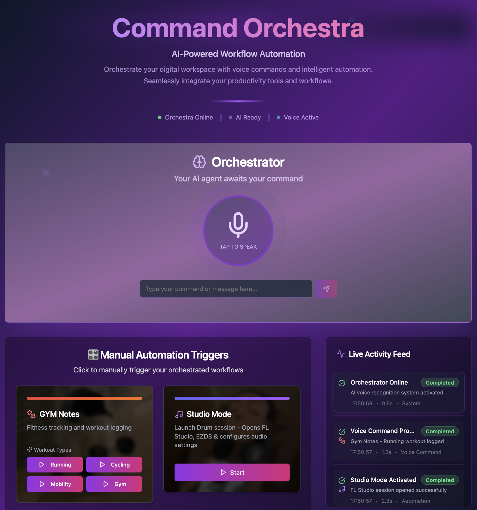

# 🎻 Command Orchestra 🪄

Welcome to your **AI Agent Automation Playground**!

## 🧬 Vision

Build your own living operating system: command your AI Agent with your voice (or text), and watch it orchestrate workflows, open apps, and automate your creative rituals. Speech-2-Action! 🗣️✨

## Overview



## Frontend Technology Stack

This project is built with modern web technologies:

- **React 18** - UI framework
- **TypeScript** - Type safety
- **Vite** - Build tool and dev server
- **Tailwind CSS** - Styling framework
- **shadcn/ui** - UI component library
- **Radix UI** - Accessible component primitives
- **React Query** - Server state management
- **React Router** - Client-side routing
- **Web Speech API** - Voice recognition

## Backend Repository

🔗 **Backend**: [Command Orchestra Backend](https://github.com/MiMa6/command-orchestra) - The Python backend that powers the automation system

## API Integration

📖 **API Documentation**: [API Integration Guide](./API_INTEGRATION.md) - Complete guide for integrating with the backend API, including endpoints, error handling, and troubleshooting

## Getting Started

### Prerequisites

- Node.js (v18 or higher)
- npm package manager

### Installation

1. Clone the repository:

```sh
git clone <repository-url>
cd command-orchestra-frontend
```

2. Install dependencies:

```sh
npm install
```

3. Start the development server:

```sh
npm run dev
```

4. Open your browser and navigate to `http://localhost:8083`

## 📦 Project Structure

```
src/
├── components/          # Reusable UI components
├── hooks/              # Custom React hooks
├── lib/                # Utility functions and configurations
├── pages/              # Page components
├── types/              # TypeScript type definitions
└── main.tsx           # Application entry point
```
