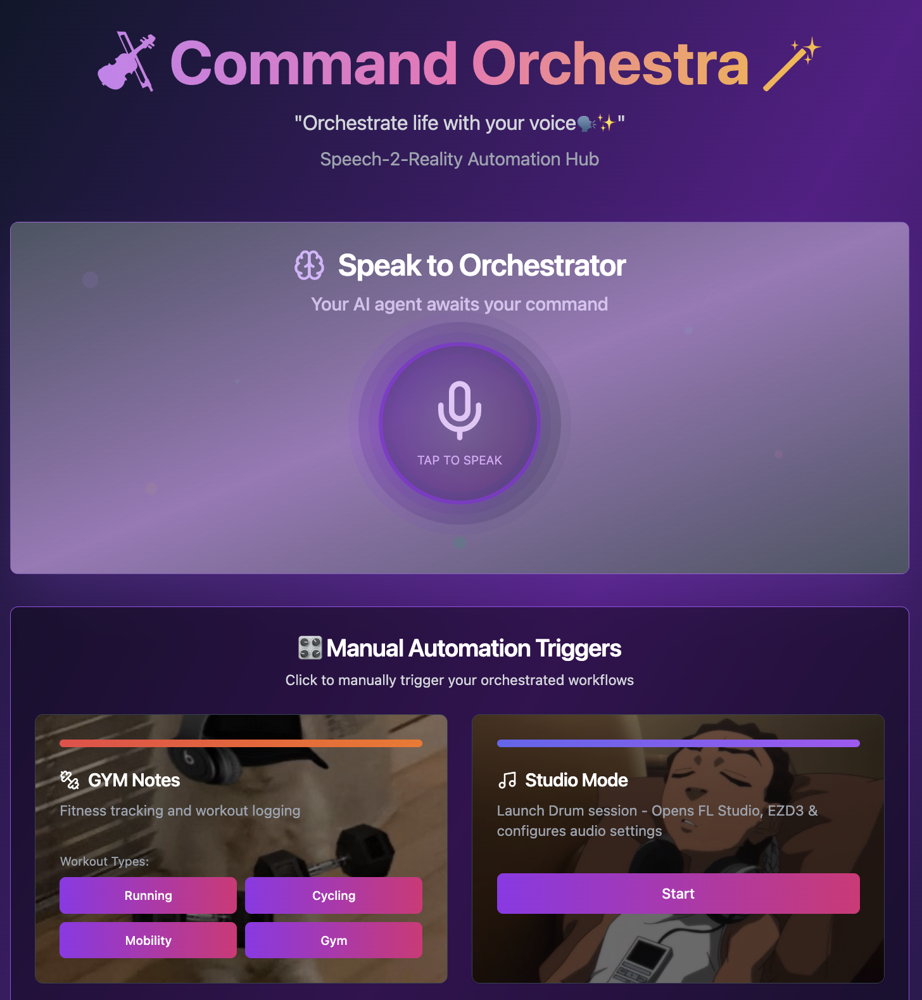

# 🎻 Command Orchestra 🪄

A voice-controlled automation system that orchestrates various productivity workflows and tools through speech recognition and manual triggers.



## Backend Repository

🔗 **Backend**: [Command Orchestra Backend](https://github.com/MiMa6/command-orchestra) - The Python backend that powers the automation system

## Overview

Command Orchestra is a modern web application that allows you to control different "modes" of your digital workspace through voice commands or manual triggers. Each mode is designed to set up specific environments for different types of work or activities.

### 🎨 Modern UI

- Beautiful gradient backgrounds
- Responsive design
- Real-time status indicators
- Interactive automation cards
- Toast notifications for feedback

## Technology Stack

This project is built with modern web technologies:

- **React 18** - UI framework
- **TypeScript** - Type safety
- **Vite** - Build tool and dev server
- **Tailwind CSS** - Styling framework
- **shadcn/ui** - UI component library
- **Radix UI** - Accessible component primitives
- **React Query** - Server state management
- **React Router** - Client-side routing
- **Web Speech API** - Voice recognition

## Getting Started

### Prerequisites

- Node.js (v18 or higher)
- npm package manager

### Installation

1. Clone the repository:

```sh
git clone <repository-url>
cd command-orchestra-frontend
```

2. Install dependencies:

```sh
npm install
```

3. Start the development server:

```sh
npm run dev
```

4. Open your browser and navigate to `http://localhost:8083`

### Building for Production

```sh
npm run build
```

The built files will be in the `dist` directory.

## Usage

1. **Voice Commands**: Click the microphone button to start voice recognition, then speak your commands naturally (e.g., "start focus mode", "gym notes running")

2. **Manual Triggers**: Click on any automation card to trigger it manually

3. **Sub-modes**: Some automations like "GYM Notes" have sub-triggers for specific activities

## Development

### Project Structure

```
src/
├── components/          # Reusable UI components
├── hooks/              # Custom React hooks
├── lib/                # Utility functions and configurations
├── pages/              # Page components
├── types/              # TypeScript type definitions
└── main.tsx           # Application entry point
```

### Key Components

- `VoiceControl` - Handles speech recognition and voice commands
- `AutomationTriggers` - Displays and manages automation cards
- `Header` - Application title and branding
- `StatusFooter` - Shows current system status

### Adding New Automations

To add a new automation mode:

1. Add the trigger definition to `automationTriggers` array in `src/pages/Index.tsx`
2. Implement the backend logic for the automation (if needed)
3. Add appropriate keywords for voice recognition
